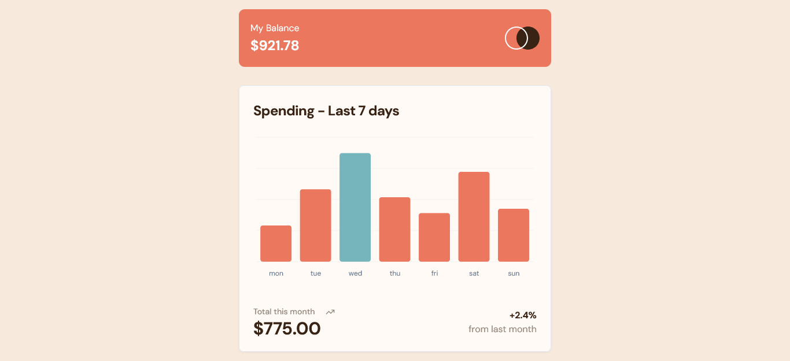

# Frontend Mentor - Expenses chart component solution

This is a solution to the [Expenses chart component challenge on Frontend Mentor](https://www.frontendmentor.io/challenges/expenses-chart-component-e7yJBUdjwt). Frontend Mentor challenges help you improve your coding skills by building realistic projects.

## Table of contents

- [Overview](#overview)
  - [The challenge](#the-challenge)
  - [Screenshot](#screenshot)
  - [Links](#links)
- [My process](#my-process)
  - [Built with](#built-with)
  - [What I learned](#what-i-learned)
- [Author](#author)

## Overview

### The challenge

Users should be able to:

- View the bar chart and hover over the individual bars to see the correct amounts for each day
- See the current day’s bar highlighted in a different colour to the other bars
- View the optimal layout for the content depending on their device’s screen size
- See hover states for all interactive elements on the page

### Screenshot



### Links

- Solution URL: [Add solution URL here](https://your-solution-url.com)
- Live Site URL: [Expenses chart](https://expenses-chart-shadcn.netlify.app/)

## My process

### Built with

- Semantic HTML5 markup
- CSS custom properties
- Flexbox
- CSS Grid
- Mobile-first workflow
- [React](https://reactjs.org/) - JS library
- [shadcn](https://ui.shadcn.com/) - reactjs component library
- [tailwindcss](https://tailwindcss.com/) - CSS framework

### What I learned

#### Creating the barchart with Shadcn

- Shadcn uses [Recharts](https://recharts.org/) under the hood. 
- the project was created using vite `npm create vite@latest`
- add Tailwind and its configuration `npm install -D tailwindcss postcss autoprefixer` and then intialise tailwind with `npx tailwindcss init -p`
- Edit `tsconfig.json` file. Add the baseUrl and paths properties to the compilerOptions section of the tsconfig.json and tsconfig.app.json files 

```js
{
  "files": [],
  "references": [
    {
      "path": "./tsconfig.app.json"
    },
    {
      "path": "./tsconfig.node.json"
    }
  ],
  "compilerOptions": {
    "baseUrl": ".",
    "paths": {
      "@/*": ["./src/*"]
    }
  }
}
```

- Edit `tsconfig.app.json` file

```js
{
  "compilerOptions": {
    // ...
    "baseUrl": ".",
    "paths": {
      "@/*": [
        "./src/*"
      ]
    }
    // ...
  }
}
```

- Update `vite.config.ts` with the following command `npm i -D @types/node` so that I can import `path` without error

```js
import path from "path"
import react from "@vitejs/plugin-react"
import { defineConfig } from "vite"

export default defineConfig({
  plugins: [react()],
  resolve: {
    alias: {
      "@": path.resolve(__dirname, "./src"),
    },
  },
})

```

- Run the CLI. Run the shadcn-ui init command to setup your project: `npx shadcn-ui@latest init`

- Configure components.json. A few questions will be asked to configure `components.json`

- Run the following command to install chart.tsx `npx shadcn-ui@latest add chart`
- a [chart tutorial guide](https://ui.shadcn.com/docs/components/chart) is found on this link.


## Author

- Website - [Add your name here](https://www.your-site.com)
- Frontend Mentor - [@yourusername](https://www.frontendmentor.io/profile/yourusername)
- Twitter - [@yourusername](https://www.twitter.com/yourusername)
